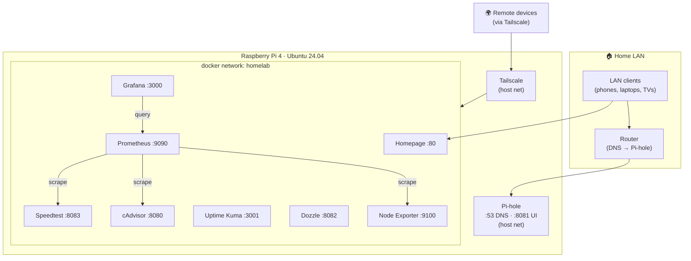

# 🏠 home-server

A production-quality, **fully Docker-Compose-based** home server for a
**Raspberry Pi 4 (4 GB) running Ubuntu Server 24.04 LTS (ARM64)**.

Everything is infrastructure-as-code: no Portainer stacks, no manual clicking.
Clone the repo, run one script, edit a few secrets, and `make up`. The whole
thing is designed to be **recreated from scratch**, **survive reboots**, and be
**easy to extend**.

---

## ✨ What's inside

| Category | Service | Purpose |
|---|---|---|
| Networking | **[Pi-hole](docs/pihole.md)** | Network-wide DNS + ad/tracker blocking |
| Monitoring | **[Prometheus](docs/prometheus.md)** | Metrics database & scraper |
| Monitoring | **[Node Exporter](docs/node-exporter.md)** | Host metrics (CPU/RAM/disk/**temp**) |
| Monitoring | **[cAdvisor](docs/cadvisor.md)** | Per-container metrics |
| Monitoring | **[Grafana](docs/grafana.md)** | Dashboards (auto-provisioned) |
| Monitoring | **[Uptime Kuma](docs/uptime-kuma.md)** | Uptime / status monitoring |
| Logging | **[Dozzle](docs/dozzle.md)** | Live container logs in the browser |
| Dashboard | **[Homepage](docs/homepage.md)** | Landing page linking every service |
| Internet | **[Speedtest Tracker](docs/speedtest-tracker.md)** | Internet speed/latency history |
| Remote | **[Tailscale](docs/tailscale.md)** | Secure remote access (no port-forwarding) |

Each service has its own file in [`compose/`](compose/) and a full doc in
[`docs/`](docs/) (what it does, why, credentials, ports, storage, troubleshooting).

---

## 🗺️ Architecture



**Key design choices**
- **`docker-compose.yml` uses Compose's `include:`** to aggregate one file per
  service from `compose/`. `docker compose up -d` brings up everything; comment
  a line to disable a service.
- **Shared `homelab` bridge network** — services talk to each other by name
  (e.g. Prometheus scrapes `cadvisor:8080`).
- **Host networking only where required** — Pi-hole (real client IPs) and
  Tailscale (host-level tunnel).
- **Bind mounts under `volumes/`** (git-ignored) — data is trivial to back up
  and inspect; **config lives in git** under `configs/`.
- **Secrets in `.env`** (git-ignored); the Speedtest scrape token is a
  git-ignored Docker-secret file.
- Every service has a **memory limit**, **restart policy**, **healthcheck**
  (where supported) and **log rotation**, and runs with **least privilege**.

---

## 📁 Repository structure

```
home-server/
├── README.md                 # you are here
├── Makefile                  # make up / down / update / backup / ...
├── docker-compose.yml        # root aggregator (include: compose/*.yml)
├── .env.example              # all config/secrets (copy to .env)
├── .gitignore
├── compose/                  # one Compose file per service
├── configs/                  # version-controlled service configuration
│   ├── grafana/…             # datasource + dashboard provisioning
│   ├── prometheus/…          # scrape config (+ git-ignored token)
│   ├── homepage/…            # dashboard YAML
│   └── pihole/…
├── volumes/                  # persistent data (git-ignored)
├── scripts/                  # install / update / backup / restore
└── docs/                     # per-service documentation
```

---

## 🚀 Installation

**Prerequisites:** Raspberry Pi 4 (4 GB), Ubuntu Server 24.04 LTS (ARM64), a
**static LAN IP / DHCP reservation** for the Pi, and internet access.

```bash
# 1. Clone onto the Pi
git clone https://github.com/lucasmma/smart-home.git home-server
cd home-server

# 2. Bootstrap the host (Docker, host prep, network, .env, volume perms)
./scripts/install.sh            # or: make install

# 3. Re-login so your docker group membership applies
newgrp docker                   # or log out/in

# 4. Fill in secrets (install.sh already auto-filled IP/paths/UID)
nano .env
#   PIHOLE_PASSWORD, GRAFANA_ADMIN_PASSWORD,
#   SPEEDTEST_APP_KEY  ->  echo "base64:$(openssl rand -base64 32)"
#   TAILSCALE_AUTHKEY  ->  from https://login.tailscale.com/admin/settings/keys

# 5. Launch everything
make up                         # or: docker compose up -d
make ps                         # check status
```

Then open **Homepage** at `http://<SERVER_IP>/`.

### Post-install (one-time)
1. **Point your router's DNS at the Pi** so Pi-hole serves the whole LAN —
   exact steps in **[docs/pihole.md](docs/pihole.md#-router-settings-to-change-after-deployment)**.
2. **Wire Speedtest → Prometheus** — create a token and enable the scrape:
   **[docs/speedtest-tracker.md](docs/speedtest-tracker.md#wiring-prometheus-metrics-one-time-after-first-boot)**.
3. **Enrol in Tailscale** for remote access — **[docs/tailscale.md](docs/tailscale.md)**.
4. *(optional)* Richer Grafana dashboards: `./scripts/fetch-dashboards.sh 1860`.

---

## 🔌 Ports, URLs & credentials

Replace `<IP>` with your `SERVER_IP`.

| Service | URL | Port | Default credentials |
|---|---|---|---|
| Homepage | `http://<IP>/` | 80 | none |
| Pi-hole | `http://<IP>:8081/admin` | 53, 8081, 8443 | `PIHOLE_PASSWORD` |
| Grafana | `http://<IP>:3000` | 3000 | `admin` / `GRAFANA_ADMIN_PASSWORD` |
| Prometheus | `http://<IP>:9090` | 9090 | none |
| cAdvisor | `http://<IP>:8080` | 8080 | none |
| Uptime Kuma | `http://<IP>:3001` | 3001 | set on first launch |
| Dozzle | `http://<IP>:8082` | 8082 | none |
| Speedtest Tracker | `http://<IP>:8083` | 8083 | `admin@example.com` / `password` |
| Node Exporter | *(internal only)* | 9100 | — |
| Tailscale | *(admin console)* | — | auth key |

> ⚠️ These services have **no or weak auth** and are meant for the **LAN only**.
> For remote access use **Tailscale**, not port-forwarding. Change all default
> passwords immediately.

---

## 🧠 Memory budget (4 GB Pi)

Hard `mem_limit` caps (worst case) vs. typical idle usage:

| Service | Cap | Typical idle |
|---|---:|---:|
| Prometheus | 512M | ~250M |
| Speedtest Tracker | 384M | ~200M |
| Grafana | 256M | ~150M |
| Pi-hole | 256M | ~120M |
| cAdvisor | 256M | ~90M |
| Uptime Kuma | 256M | ~120M |
| Homepage | 256M | ~100M |
| Node Exporter | 128M | ~20M |
| Dozzle | 128M | ~15M |
| Tailscale | 128M | ~40M |
| **Total (typical)** | | **~1.1 GB** |

Comfortably within 4 GB, leaving headroom for the OS and page cache. Caps
prevent any single service from OOM-ing the Pi.

---

## ⬆️ Upgrade guide

```bash
make update          # or: ./scripts/update.sh
```
This backs up first (safety net), pulls the latest images, recreates only the
changed containers, and prunes dangling images.

> **Reproducible upgrades:** pin versions in `.env` (e.g. `PIHOLE_VERSION`,
> `GRAFANA_VERSION`) instead of `latest`, bump them deliberately, then
> `make update`.

---

## 💾 Backup & restore guide

```bash
# Back up .env + configs/ + volumes/  → ./backups/home-server-<timestamp>.tar.gz
make backup                          # hot backup (no downtime)
STOP=1 ./scripts/backup.sh           # stop stack first (DB-consistent)
INCLUDE_PROMETHEUS=1 ./scripts/backup.sh   # also include the metrics TSDB
KEEP=14 ./scripts/backup.sh          # change retention (default: keep 7)

# Restore (overwrites .env, configs/, volumes/, re-fixes ownership)
make restore f=backups/home-server-YYYYMMDD-HHMMSS.tar.gz
```

By default Prometheus' TSDB is excluded (bulky, regenerable). Everything needed
to reconstruct the server — config, DNS lists, dashboards, uptime history,
speedtest history — is captured. Copy archives off the Pi periodically.

---

## ➕ Adding a new service

1. Create `compose/<service>.yml` (copy an existing one as a template — keep the
   `mem_limit`, `restart`, `healthcheck`, `security_opt`, `logging`, and the
   `external: true` `homelab` network block).
2. Put any config under `configs/<service>/`, data path under
   `volumes/<service>/`.
3. Add secrets/versions to `.env.example` (and your `.env`).
4. Add an `include:` line in `docker-compose.yml`.
5. Add a card in `configs/homepage/services.yaml`.
6. Write `docs/<service>.md`.
7. `docker compose config` to validate, then `make up`.

---

## 🛠️ Handy commands (`make help`)

| Command | Action |
|---|---|
| `make up` / `make down` | start / stop the stack |
| `make ps` | container status |
| `make logs s=grafana` | tail one service's logs |
| `make config` | render & validate the merged Compose config |
| `make pull` / `make restart` | pull images / recreate all |
| `make update` | pull + recreate changed + prune |
| `make backup` / `make restore f=…` | snapshot / restore |

---

## 🔒 Security notes

- No secrets in git — `.env` and the speedtest token are git-ignored.
- Containers run with `no-new-privileges`, dropped to specific capabilities;
  **no privileged containers** (cAdvisor documents a fallback if your kernel
  needs it).
- Docker socket (Dozzle) is mounted **read-only**.
- LAN-only by design; remote access via Tailscale.

---

## 🧯 Troubleshooting

Each service's doc has a troubleshooting table. Common starting points:
- `make logs s=<service>` — live logs for one service.
- `http://<IP>:9090/targets` — which Prometheus scrapes are up/down.
- Dozzle (`:8082`) — logs for everything at once.
- Permission errors on Prometheus/Grafana → re-run the `chown` from
  `install.sh` (uids `65534` / `472`).

---

## 📜 License

MIT — see `LICENSE`. Use it, fork it, make it yours.
